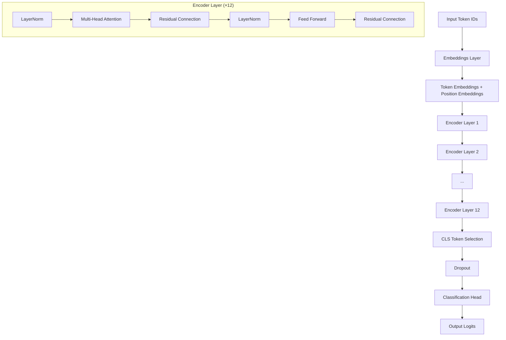
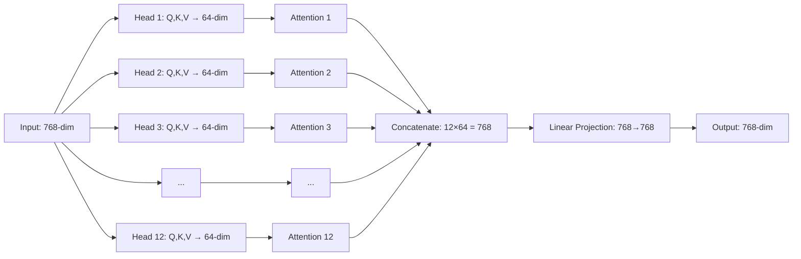

# Transformer Model Architecture Documentation

This document provides a comprehensive breakdown of the Transformer model implementation in `models.py`, with detailed explanations of each component using BERT-base default configurations.

## Table of Contents

- [Overview](#overview)
- [Architecture Diagrams](#architecture-diagrams)
- [Component Deep Dive](#component-deep-dive)
- [Dimension Flow](#dimension-flow)
- [Training Process](#training-process)

## Overview

Our Transformer implementation follows the encoder-only architecture (like BERT) for sequence classification tasks. The model processes input token sequences through multiple layers of self-attention and feed-forward networks to produce rich, contextualized representations.

### BERT-base Default Configuration

- **hidden_size**: 768 (embedding dimension)
- **num_attention_heads**: 12 (multi-head attention)
- **num_hidden_layers**: 12 (encoder layers)
- **intermediate_size**: 3072 (feed-forward hidden size)
- **vocab_size**: 30,522 (vocabulary size)
- **max_position_embeddings**: 512 (maximum sequence length)

## Architecture Diagrams

### Complete Model Architecture



### Multi-Head Attention Detail



## Component Deep Dive

### 1. Scaled Dot-Product Attention

**Mathematical Formula:**

```
Attention(Q, K, V) = softmax(QK^T / √d_k)V
```

**Step-by-Step Process:**

#### Step 1: Compute Attention Scores

```
scores = Q × K^T / √d_k

Where:
- Q (Query): "What am I looking for?" - shape: (batch_size, seq_len_q, 64)
- K (Key): "What do I contain?" - shape: (batch_size, seq_len_k, 64)
- V (Value): "What information do I provide?" - shape: (batch_size, seq_len_v, 64)
- d_k: Dimension of key vectors = 64 (for BERT-base head_dim)
```

#### Step 2: Apply Softmax (Attention Weights)

```
weights = softmax(scores)

Result: Each query position gets a probability distribution over all key positions
weights.shape = (batch_size, seq_len_q, seq_len_k)
```

#### Step 3: Weighted Sum of Values

```
output = weights × V

Result: Context-aware representation for each query position
output.shape = (batch_size, seq_len_q, 64)
```

**Example with BERT-base Dimensions:**

```python
# Single attention head with head_dim = 64 (BERT-base default)
query.shape = (32, 128, 64)   # batch=32, seq_len=128, head_dim=64
key.shape   = (32, 128, 64)   # Same sequence attending to itself
value.shape = (32, 128, 64)   # Same sequence providing values

# Step 1: Attention scores
scores = bmm(query, key.transpose(-2, -1)) / √64
scores.shape = (32, 128, 128)  # Each token can attend to all 128 tokens

# Step 2: Attention weights (probabilities)
weights = softmax(scores, dim=-1)
weights.shape = (32, 128, 128)  # Probabilities sum to 1 across last dim

# Step 3: Weighted values
output = bmm(weights, value)
output.shape = (32, 128, 64)   # Context-aware representations
```

**Why Scaling by √d_k = √64 = 8?**

- Prevents attention scores from becoming too large
- Keeps gradients stable during training
- Without scaling: softmax saturates → poor gradients

### 2. Attention Head

**Purpose of Attention Heads:**
Each attention head learns to focus on different types of relationships:

- Head 1: Might focus on syntactic relationships (subject-verb)
- Head 2: Might focus on semantic relationships (word meanings)
- Head 3: Might focus on positional relationships (nearby words)

**Architecture (Using BERT-base defaults):**

```
Input: hidden_state (batch_size, seq_len, 768)  # embed_dim = 768
       ↓
┌─────────────────────────────────────────────────┐
│  Linear Projections (Learned Transformations)   │
│                                                 │
│  Q = hidden_state × W_q  (768 → 64)            │
│  K = hidden_state × W_k  (768 → 64)            │
│  V = hidden_state × W_v  (768 → 64)            │
└─────────────────────────────────────────────────┘
       ↓
┌─────────────────────────────────────────────────┐
│     Scaled Dot-Product Attention                │
│                                                 │
│  Attention(Q,K,V) = softmax(QK^T/√64)V         │
└─────────────────────────────────────────────────┘
       ↓
Output: attention_output (batch_size, seq_len, 64)  # head_dim = 64
```

**Why These Specific Dimensions?**

1. **embed_dim = 768**: BERT-base hidden size (fixed architecture choice)
2. **head_dim = 64**: 768 ÷ 12 heads = 64 dimensions per head
3. **Efficiency**: 12 smaller 64-dim heads vs 1 large 768-dim head
4. **Specialization**: Each 64-dim head learns different relationships

### 3. Multi-Head Attention

**Why Multiple Heads?**
Different attention heads can specialize in different types of relationships:

- **Syntactic heads**: Focus on grammatical relationships (subject-verb, adjective-noun)
- **Semantic heads**: Focus on meaning relationships (synonyms, antonyms)
- **Positional heads**: Focus on distance-based relationships (nearby words)
- **Long-range heads**: Focus on dependencies across long distances

**Architecture Flow (BERT-base: 12 heads, 768 hidden_size):**

```
Input: hidden_state (batch_size, seq_len, 768)
       ↓
┌─────────────────────────────────────────────────────────┐
│                Parallel Attention Heads                 │
│                                                         │
│  Head 1: (768→64) → Attention → (seq_len, 64)          │
│  Head 2: (768→64) → Attention → (seq_len, 64)          │
│  Head 3: (768→64) → Attention → (seq_len, 64)          │
│  ...                                                    │
│  Head 12: (768→64) → Attention → (seq_len, 64)         │
└─────────────────────────────────────────────────────────┘
       ↓
┌─────────────────────────────────────────────────────────┐
│              Concatenate Head Outputs                   │
│                                                         │
│  Concat: [Head1, Head2, ..., Head12]                   │
│  Shape: (batch_size, seq_len, 12×64 = 768)             │
└─────────────────────────────────────────────────────────┘
       ↓
┌─────────────────────────────────────────────────────────┐
│              Output Linear Projection                   │
│                                                         │
│  output = concat × W_o  (768 → 768)                    │
│  Shape: (batch_size, seq_len, 768)                     │
└─────────────────────────────────────────────────────────┘
```

**Benefits of Multi-Head Attention:**

1. **Parallel Processing**: All 12 heads compute simultaneously
2. **Diverse Perspectives**: Each head learns different relationships
3. **Rich Representations**: Combined output captures multiple aspects
4. **Computational Efficiency**: 12×64-dim heads vs 1×768-dim head

### 4. Feed Forward Network

**Architecture Pattern: Expand → Activate → Contract**

```
Input: (batch_size, seq_len, hidden_size=768)
       ↓
┌─────────────────────────────────────────────────┐
│              Linear Expansion                   │
│                                                 │
│  linear1: 768 → 3072 (4x expansion)            │
│  Purpose: Create richer representation space    │
└─────────────────────────────────────────────────┘
       ↓
┌─────────────────────────────────────────────────┐
│              GELU Activation                    │
│                                                 │
│  Smooth, differentiable non-linearity           │
│  Better than ReLU for language tasks            │
└─────────────────────────────────────────────────┘
       ↓
┌─────────────────────────────────────────────────┐
│              Linear Contraction                 │
│                                                 │
│  linear2: 3072 → 768 (back to original size)   │
│  Purpose: Project back to model dimension       │
└─────────────────────────────────────────────────┘
       ↓
┌─────────────────────────────────────────────────┐
│                 Dropout                         │
│                                                 │
│  Regularization to prevent overfitting          │
└─────────────────────────────────────────────────┘
       ↓
Output: (batch_size, seq_len, hidden_size=768)
```

**Why This Design?**

1. **Position-wise Processing**: Each token position is processed independently
2. **Expansion-Contraction Pattern**: 4x expansion ratio is empirically optimal
3. **GELU Activation**: Smooth, probabilistic activation better than ReLU
4. **Computational Role**: Attention determines "what to look at", FFN determines "what to do with it"

### 5. Transformer Encoder Layer

**Architecture: Pre-LayerNorm Design**

```
Input: x (batch_size, seq_len, hidden_size)
       ↓
┌─────────────────────────────────────────────────┐
│              First Sub-Layer                    │
│                                                 │
│  LayerNorm → MultiHeadAttention → Residual      │
│      ↓              ↓               ↓           │
│  norm1(x) → attention(norm1(x)) → x + attn_out  │
└─────────────────────────────────────────────────┘
       ↓
┌─────────────────────────────────────────────────┐
│              Second Sub-Layer                   │
│                                                 │
│  LayerNorm → FeedForward → Residual             │
│      ↓           ↓           ↓                  │
│  norm2(x) → ffn(norm2(x)) → x + ffn_out         │
└─────────────────────────────────────────────────┘
       ↓
Output: x (batch_size, seq_len, hidden_size)
```

**Key Design Principles:**

1. **Pre-LayerNorm**: Better gradient flow, more stable training
2. **Residual Connections**: Prevent vanishing gradients, enable deeper networks
3. **Two Sub-Layers**: Attention (token interactions) + Feed-Forward (token transformations)

### 6. Embeddings Layer

**The Complete Conversion Process: Sparse Token IDs → Dense Vectors**

**Step 1: Tokenizer Output (Input to Embeddings)**

```python
text = "Hello world"
input_ids = [101, 7592, 2088, 102]  # Sparse integers from tokenizer
input_ids.shape = (batch_size, seq_length)  # e.g., (1, 4)
```

**Step 2: Token Embedding Lookup**

```python
self.token_embeddings = nn.Embedding(vocab_size, hidden_size)
# With BERT-base-uncased: nn.Embedding(30522, 768)
# Creates a lookup table: 30,522 rows × 768 columns

Token ID 101  → Row 101  → [0.1, -0.2, 0.8, ..., 0.3]  (768 values)
Token ID 7592 → Row 7592 → [0.5,  0.1, -0.4, ..., 0.7]  (768 values)
Token ID 2088 → Row 2088 → [-0.1, 0.9, 0.2, ..., -0.5] (768 values)
Token ID 102  → Row 102  → [0.8, -0.4, 0.1, ..., 0.9]  (768 values)

Result: token_embeddings.shape = (batch_size, seq_length, hidden_size)
```

**Step 3: Position Embedding Lookup**

```python
position_ids = [0, 1, 2, 3]  # Created dynamically based on seq_length
self.position_embeddings = nn.Embedding(max_position_embeddings, hidden_size)
# With BERT-base-uncased: nn.Embedding(512, 768)

Position 0 → Row 0 → [0.2,  0.9, -0.1, ..., 0.4]  (768 values)
Position 1 → Row 1 → [-0.3, 0.6,  0.7, ..., -0.2] (768 values)
Position 2 → Row 2 → [0.8, -0.4,  0.1, ..., 0.9]  (768 values)
Position 3 → Row 3 → [0.1,  0.5, -0.8, ..., 0.6]  (768 values)

Result: position_embeddings.shape = (1, seq_length, hidden_size)
```

**Step 4: Element-wise Addition + Normalization**

```python
embeddings = token_embeddings + position_embeddings  # Broadcasting
embeddings = layer_norm(embeddings)
embeddings = dropout(embeddings)

Final shape: (batch_size, seq_length, hidden_size)
```

### 7. Complete Transformer Encoder

**Information Processing Through Layers:**

- **Layer 1-3: Low-level Features**: Basic linguistic patterns, syntax, word relationships
- **Layer 4-8: Mid-level Features**: Complex syntax, semantic relationships, entity recognition
- **Layer 9-12: High-level Features**: Abstract semantics, discourse, global context

**Progressive Representation Building:**

```python
# Layer 0 (Embeddings): Basic token + position information
embeddings = token_emb + pos_emb  # (batch, seq_len, 768)

# Layer 1: Local context and basic patterns
layer1_out = encoder_layer_1(embeddings)

# Layer 2: More complex relationships
layer2_out = encoder_layer_2(layer1_out)

# ... progressive refinement through layers 3-11 ...

# Layer 12: Rich, contextualized representations
final_out = encoder_layer_12(layer11_out)
```

### 8. Sequence Classification Head

**Why Use [CLS] Token?**

1. **Sequence Representation**: [CLS] is added at the beginning of every sequence
2. **Bidirectional Context**: Through self-attention, it can attend to ALL other tokens
3. **Training Objective**: During pre-training, [CLS] is used for Next Sentence Prediction

**Architecture: Encoder + Classification Head**

```
Input: Token IDs [101, 7592, 2088, 102]  # [CLS] Hello world [SEP]
       ↓
┌─────────────────────────────────────────────────┐
│              Transformer Encoder                │
│                                                 │
│  Embeddings → Layer1 → Layer2 → ... → Layer12  │
│  Output: (batch_size, seq_len, hidden_size)     │
└─────────────────────────────────────────────────┘
       ↓
┌─────────────────────────────────────────────────┐
│              [CLS] Token Selection              │
│                                                 │
│  Extract first token: encoder_output[:, 0, :]   │
│  Shape: (batch_size, hidden_size)               │
└─────────────────────────────────────────────────┘
       ↓
┌─────────────────────────────────────────────────┐
│                  Dropout                        │
│                                                 │
│  Regularization: prevent overfitting            │
│  Shape: (batch_size, hidden_size)               │
└─────────────────────────────────────────────────┘
       ↓
┌─────────────────────────────────────────────────┐
│              Classification Head                │
│                                                 │
│  Linear: hidden_size → num_labels               │
│  Shape: (batch_size, num_labels)                │
└─────────────────────────────────────────────────┘
       ↓
Output: Logits for each class [spam_score, ham_score]
```

## Dimension Flow

### Complete Model Dimension Flow (BERT-base defaults):

```
Input IDs:        (32, 128)      # batch=32, seq_len=128
                  ↓
Embeddings:       (32, 128, 768) # Token + position embeddings
                  ↓
Layer 1:          (32, 128, 768) # First encoder layer
                  ↓
Layer 2:          (32, 128, 768) # Second encoder layer
                  ↓
...               ...            # Layers 3-11
                  ↓
Layer 12:         (32, 128, 768) # Final encoder layer (12th layer)
                  ↓
[CLS] Selection:  (32, 768)      # Just the [CLS] token
                  ↓
Dropout:          (32, 768)      # Regularization
                  ↓
Classifier:       (32, 2)        # Binary classification logits
                  ↓
Softmax:          (32, 2)        # Probabilities [P(ham), P(spam)]
```

### Parameter Counts:

- **Token Embedding Table**: (30,522 × 768) = 23,440,896 parameters
- **Position Embedding Table**: (512 × 768) = 393,216 parameters
- **Feed Forward per layer**: ~4.7M parameters per layer
- **Total BERT-base**: ~110M parameters

## Training Process

1. **Forward Pass**: Input → Encoder → [CLS] → Classifier → Logits
2. **Loss Calculation**: CrossEntropyLoss(logits, true_labels)
3. **Backward Pass**: Gradients flow back through entire network
4. **Parameter Update**: Both encoder and classifier weights updated

## Use Cases

- **Sentiment Analysis**: Positive/Negative/Neutral
- **Spam Detection**: Spam/Ham (this implementation)
- **Topic Classification**: Sports/Politics/Technology/etc.
- **Intent Recognition**: Question/Request/Complaint/etc.
