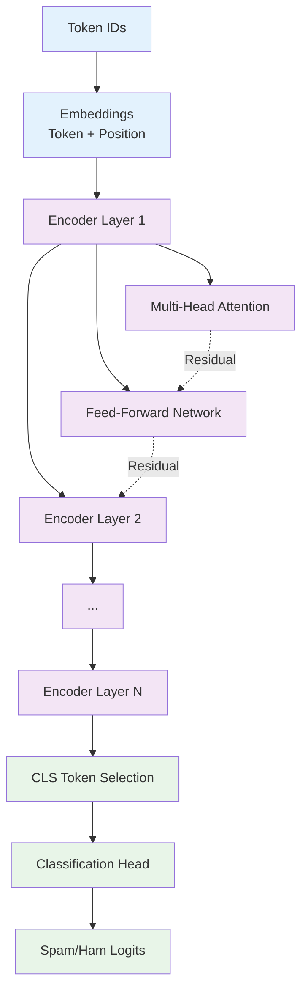

# Transformer Encoder from Scratch - Comprehensive Documentation

This project contains a complete implementation of a Transformer Encoder built from scratch using PyTorch, designed for sequence classification tasks (specifically spam/ham email classification). The implementation includes custom attention mechanisms, feed-forward networks, and a full training pipeline with inference capabilities.

## Project Architecture Overview

The project is structured into several key components that work together to provide a complete machine learning pipeline:

```
training/
├── pyproject.toml          # Project dependencies and metadata
├── models.py               # Core Transformer architecture implementation
├── train.py                # Main training script with full pipeline
├── main.py                 # Simple inference demonstration
├── data/
│   ├── __init__.py
│   └── preparation.py      # Data loading, preprocessing, and tokenization
├── utils/
│   ├── __init__.py
│   └── helpers.py          # Utility functions and argument parsing
└── README.md               # This documentation

../inference.py             # Standalone inference script for trained models
../dataprocessing/main.go   # Go-based data preprocessing pipeline
```

## Model Architecture Deep Dive

### Core Components (`models.py`)

The Transformer implementation is built hierarchically with the following components:

#### 1. **Scaled Dot-Product Attention** (`scaled_dot_product_attention`)

- **Purpose**: Fundamental attention mechanism computing attention weights
- **Input**: Query, Key, Value tensors
- **Output**: Attention-weighted values and attention matrix
- **Formula**: `Attention(Q,K,V) = softmax(QK^T/√d_k)V`

#### 2. **Attention Head** (`AttentionHead`)

- **Purpose**: Single attention head with learnable Q, K, V projections
- **Components**:
  - `self.q`: Linear layer for query projection
  - `self.k`: Linear layer for key projection
  - `self.v`: Linear layer for value projection
- **Process**: Projects input → Computes attention → Returns weighted output

#### 3. **Multi-Head Attention** (`MultiHeadAttention`)

- **Purpose**: Combines multiple attention heads for richer representations
- **Architecture**:
  - Multiple `AttentionHead` instances in parallel
  - Concatenation of head outputs
  - Final linear projection to original dimension
- **Key Features**:
  - Validates embedding dimension divisibility by number of heads
  - Preserves input/output dimensions
  - Stores attention matrices for visualization

#### 4. **Feed-Forward Network** (`FeedForward`)

- **Purpose**: Position-wise fully connected network for feature transformation
- **Architecture**:
  - `linear1`: Input → Intermediate dimension expansion
  - `gelu`: Gaussian Error Linear Unit activation
  - `linear2`: Intermediate → Original dimension
  - `dropout`: Regularization layer
- **Typical Flow**: `hidden_size → intermediate_size → hidden_size`

#### 5. **Transformer Encoder Layer** (`TransformerEncoderLayer`)

- **Purpose**: Complete encoder block with attention and feed-forward
- **Architecture**:
  - Multi-head self-attention
  - Residual connections around each sub-layer
  - Layer normalization after each residual connection
  - Feed-forward network
- **Process**: `Input → LayerNorm → Attention → Residual → LayerNorm → FFN → Residual`

#### 6. **Embeddings Layer** (`Embeddings`)

- **Purpose**: Convert token IDs to dense vector representations
- **Components**:
  - `token_embeddings`: Vocabulary → Hidden dimension mapping
  - `position_embeddings`: Position → Hidden dimension mapping
  - `layer_norm`: Normalization for stability
  - `dropout`: Regularization
- **Process**: `Token Embeddings + Position Embeddings → LayerNorm → Dropout`

#### 7. **Transformer Encoder** (`TransformerEncoder`)

- **Purpose**: Stack of encoder layers with embeddings
- **Architecture**:
  - Embeddings layer for input processing
  - Multiple `TransformerEncoderLayer` instances
- **Flow**: `Input IDs → Embeddings → Layer₁ → Layer₂ → ... → LayerN`

#### 8. **Transformer for Sequence Classification** (`TransformerForSequenceClassification`)

- **Purpose**: Complete model for classification tasks
- **Architecture**:
  - `encoder`: Full Transformer encoder
  - `dropout`: Regularization before classification
  - `classifier`: Linear layer for final predictions
- **Classification Strategy**: Uses [CLS] token (first token) representation

## Visual Architecture Diagrams

### Complete Architecture Flow

The following diagram shows the detailed hierarchical structure and data flow through the entire Transformer model:

```mermaid
graph TD
    %% Input Layer
    A[Input Token IDs<br/>batch_size × seq_length] --> B[TransformerForSequenceClassification]

    %% Main Model Structure
    B --> C[TransformerEncoder]
    B --> D[Dropout]
    B --> E[Linear Classifier<br/>hidden_size → num_labels]

    %% TransformerEncoder Components
    C --> F[Embeddings Layer]
    C --> G[Encoder Layers Stack<br/>×N layers]

    %% Embeddings Layer Details
    F --> F1[Token Embeddings<br/>vocab_size → hidden_size]
    F --> F2[Position Embeddings<br/>max_pos → hidden_size]
    F --> F3[Element-wise Addition<br/>token + position]
    F --> F4[LayerNorm]
    F --> F5[Dropout]

    F1 --> F3
    F2 --> F3
    F3 --> F4
    F4 --> F5

    %% Single Encoder Layer Structure
    G --> H[TransformerEncoderLayer]
    H --> H1[LayerNorm 1]
    H --> H2[MultiHeadAttention]
    H --> H3[Residual Connection 1]
    H --> H4[LayerNorm 2]
    H --> H5[FeedForward]
    H --> H6[Residual Connection 2]

    %% MultiHeadAttention Details
    H2 --> I[Multiple Attention Heads<br/>×num_heads]
    I --> I1[AttentionHead 1]
    I --> I2[AttentionHead 2]
    I --> I3[AttentionHead N]
    I --> I4[Concatenate Outputs]
    I --> I5[Output Linear<br/>hidden_size → hidden_size]

    %% Single Attention Head Details
    I1 --> J1[Query Linear<br/>hidden_size → head_dim]
    I1 --> J2[Key Linear<br/>hidden_size → head_dim]
    I1 --> J3[Value Linear<br/>hidden_size → head_dim]
    I1 --> J4[Scaled Dot-Product Attention]

    J1 --> J4
    J2 --> J4
    J3 --> J4

    %% Scaled Dot-Product Attention Details
    J4 --> K1[Q × K^T / √d_k]
    K1 --> K2[Softmax]
    K2 --> K3[Attention Weights × V]

    %% FeedForward Network Details
    H5 --> L1[Linear 1<br/>hidden_size → intermediate_size]
    L1 --> L2[GELU Activation]
    L2 --> L3[Linear 2<br/>intermediate_size → hidden_size]
    L3 --> L4[Dropout]

    %% Data Flow Connections
    F5 --> H1
    H1 --> H2
    H2 --> H3
    H3 --> H4
    H4 --> H5
    H5 --> H6

    %% Residual Connections
    H1 -.->|+| H3
    H4 -.->|+| H6

    %% Output Flow
    H6 --> M[Encoder Output<br/>batch_size × seq_length × hidden_size]
    M --> N[Select [CLS] Token<br/>[:, 0, :]]
    N --> D
    D --> E
    E --> O[Logits<br/>batch_size × num_labels]

    %% Styling
    classDef inputOutput fill:#e1f5fe,stroke:#01579b,stroke-width:2px
    classDef mainModel fill:#f3e5f5,stroke:#4a148c,stroke-width:2px
    classDef attention fill:#fff3e0,stroke:#e65100,stroke-width:2px
    classDef feedforward fill:#e8f5e8,stroke:#1b5e20,stroke-width:2px
    classDef embedding fill:#fce4ec,stroke:#880e4f,stroke-width:2px
    classDef operation fill:#f1f8e9,stroke:#33691e,stroke-width:1px

    class A,O inputOutput
    class B,C,G,H mainModel
    class H2,I,I1,I2,I3,I4,I5,J1,J2,J3,J4,K1,K2,K3 attention
    class H5,L1,L2,L3,L4 feedforward
    class F,F1,F2,F3,F4,F5 embedding
    class H1,H3,H4,H6,D,E,M,N operation
```

### Architecture Components Legend

#### 🔵 Input/Output (Blue)

- **Input Token IDs**: Tokenized text input
- **Logits**: Final classification scores

#### 🟣 Main Model (Purple)

- **TransformerForSequenceClassification**: Top-level model
- **TransformerEncoder**: Core encoder stack
- **TransformerEncoderLayer**: Individual encoder layer

#### 🟠 Attention Mechanism (Orange)

- **MultiHeadAttention**: Parallel attention computation
- **AttentionHead**: Individual attention head
- **Scaled Dot-Product Attention**: Core attention operation

#### 🟢 Feed-Forward Network (Green)

- **Linear Layers**: Dense transformations
- **GELU Activation**: Non-linear activation function
- **Dropout**: Regularization

#### 🟡 Embeddings (Pink)

- **Token Embeddings**: Vocabulary to vector mapping
- **Position Embeddings**: Positional encoding
- **Element-wise Addition**: Combining token and position info

#### 🟢 Operations (Light Green)

- **LayerNorm**: Normalization layers
- **Residual Connections**: Skip connections (dotted lines)
- **Dropout**: Regularization layers

### Simplified Architecture Overview

For a high-level understanding, here's a simplified view of the model flow:



### Data Flow Summary

1. **Input Processing**: Token IDs → Embeddings (token + position)
2. **Encoder Stack**: Multiple transformer layers with attention and feed-forward
3. **Classification**: [CLS] token → Dropout → Linear classifier → Logits

### Key Architectural Features

- **Parallel Processing**: All positions processed simultaneously
- **Multi-Head Attention**: Multiple attention perspectives for richer representations
- **Residual Connections**: Skip connections (dotted lines) for gradient flow
- **Layer Normalization**: Stabilizes training at each step
- **Position Awareness**: Positional embeddings provide sequence order information
- **Pre-Layer Normalization**: LayerNorm applied before attention and feed-forward (Pre-LN architecture)

## Training Pipeline (`train.py`)

### Key Features

- **Multi-GPU Support**: Automatic DataParallel wrapping for multiple GPUs
- **Experiment Tracking**: Weights & Biases (wandb) integration
- **Checkpointing**: Periodic and best model saving
- **Validation**: Comprehensive evaluation with accuracy metrics
- **Device Detection**: Automatic CUDA/MPS/CPU selection

### Training Process

1. **Configuration Loading**: Loads model config and tokenizer from Hugging Face
2. **Data Preparation**: Processes JSON datasets for ham/spam classification
3. **Model Instantiation**: Creates custom Transformer with specified config
4. **Optimization**: AdamW optimizer with configurable learning rate
5. **Training Loop**:
   - Batch processing with progress tracking
   - Loss computation using CrossEntropyLoss
   - Gradient updates and backpropagation
   - Periodic checkpointing
6. **Validation**:
   - Model evaluation on test set
   - Accuracy and loss computation
   - Best model tracking and saving
7. **Model Persistence**: Saves final model, config, and tokenizer

### Command Line Arguments

```bash
python train.py [OPTIONS]

Key Arguments:
--model_ckpt: Base model for config/tokenizer (default: bert-base-uncased)
--num_labels: Number of classification classes (default: 2)
--max_length: Maximum sequence length (default: 512)
--batch_size: Training batch size (default: 8)
--epochs: Number of training epochs (default: 3)
--lr: Learning rate (default: 2e-5)
--output_dir: Model save directory (default: ./model_output)
```

## Data Processing Pipeline (`data/preparation.py`)

### Core Functions

#### 1. **Data Loading**

- `load_json_data()`: Loads individual JSON files
- `load_separate_train_test_data()`: Combines separate train/test files
- `combineandload_spamandham()`: Legacy function for backward compatibility

#### 2. **Data Preparation** (`prepare_data`)

- **Tokenization**: Converts text to model-compatible format
- **Caching**: Saves tokenized datasets for faster subsequent runs
- **Validation**: Ensures required columns exist
- **DataLoader Creation**: Creates PyTorch DataLoaders for training/evaluation

#### 3. **Dataset Format**

Expected JSON structure:

```json
{
  "dataset": [
    { "text": "Email content here..." },
    { "text": "Another email..." }
  ]
}
```

## Utility Functions (`utils/helpers.py`)

### Device Management

- `get_device()`: Automatic device detection (CUDA → MPS → CPU)

### Argument Parsing

- `parse_train_args()`: Comprehensive command-line argument handling
- Supports all training hyperparameters and data configuration

## Simple Inference Demo (`main.py`)

### Purpose

Demonstrates basic model usage with a single text example.

### Process

1. Loads configuration and tokenizer
2. Tokenizes sample text
3. Instantiates model
4. Performs forward pass
5. Displays output logits

## Advanced Inference System (`../inference.py`)

### Comprehensive Inference Features

#### 1. **Model Loading**

- Supports multiple model file formats (`.pt`, `.bin`)
- Handles both full checkpoints and state dictionaries
- Automatic config and tokenizer loading
- Device-aware model loading

#### 2. **Inference Modes**

##### Single Text Classification

```bash
python inference.py --text "Your email content here"
```

##### Batch File Processing

```bash
python inference.py --input_file texts.txt --output_file results.txt
```

#### 3. **Output Information**

For each prediction:

- **Prediction**: Ham or Spam classification
- **Confidence**: Probability of predicted class
- **Probabilities**: Both ham and spam probabilities
- **Logits**: Raw model outputs
- **Text Preview**: First 100 characters of input

#### 4. **Configuration Options**

```bash
--model_dir: Directory containing model files (default: ./model_output)
--model_file: Specific model file to use (default: best_model.pt)
--batch_size: Batch size for processing (default: 8)
--device: Force specific device (cuda/mps/cpu)
```

#### 5. **Model File Support**

- `best_model.pt`: Best performing model from training
- `pytorch_model.bin`: Standard PyTorch model file
- `checkpoint_*.pt`: Training checkpoints with metadata

## Data Preprocessing (`../dataprocessing/main.go`)

### Go-based Email Processing Pipeline

#### Features

- **High-Performance**: Concurrent processing with configurable worker pools
- **Email Formatting**: Structures emails with headers and content
- **Output Format**: Generates separate JSON files for ham/spam
- **Error Handling**: Robust CSV parsing with error recovery

#### Email Format Template

```
[CLS] email_from: <sender> [SEP] email_to: <recipient> [SEP] subject: <subject> [SEP] message: <content>
```

#### Usage

```bash
go run ../dataprocessing/main.go [OPTIONS]

Options:
--workers: Number of concurrent workers (default: CPU cores × 2)
--input: Input CSV file path
--ham: Output ham JSON file path
--spam: Output spam JSON file path
--buffer: Channel buffer size for performance tuning
```

## Setup and Installation

### Using uv (Recommended)

1. **Install uv**:

   ```bash
   # Linux/macOS
   curl -LsSf https://astral.sh/uv/install.sh | sh
   # Windows
   powershell -c "irm https://astral.sh/uv/install.ps1 | iex"
   ```

2. **Create Virtual Environment**:

   ```bash
   cd training
   uv venv
   source .venv/bin/activate  # Linux/macOS
   # or .venv\Scripts\activate.bat  # Windows
   ```

3. **Install Dependencies**:
   ```bash
   uv pip install -e .
   ```

## Usage Examples

### Training a Model

```bash
# Basic training
python train.py

# Custom configuration
python train.py --epochs 5 --batch_size 16 --lr 1e-5 --output_dir ./my_model
```

### Running Inference

```bash
# Single text
python ../inference.py --text "Congratulations! You've won $1000!"

# Batch processing
python ../inference.py --input_file emails.txt --output_file predictions.txt

# Use specific model
python ../inference.py --model_file checkpoint_step_1000.pt --text "Hello world"
```

### Data Processing

```bash
# Process email CSV
go run ../dataprocessing/main.go --input emails.csv --workers 8
```

## Model Configuration

The model uses standard Transformer configuration parameters:

- `hidden_size`: Embedding and hidden layer dimension
- `num_attention_heads`: Number of attention heads per layer
- `num_hidden_layers`: Number of encoder layers
- `intermediate_size`: Feed-forward network intermediate dimension
- `vocab_size`: Vocabulary size for embeddings
- `max_position_embeddings`: Maximum sequence length
- `num_labels`: Number of classification classes
- `hidden_dropout_prob`: Dropout probability
- `layer_norm_eps`: Layer normalization epsilon

## Performance Considerations

### Training Optimizations

- **Multi-GPU**: Automatic DataParallel for multiple GPUs
- **Checkpointing**: Regular saves to prevent data loss
- **Caching**: Tokenized dataset caching for faster restarts
- **Progress Tracking**: Real-time training metrics

### Inference Optimizations

- **Batch Processing**: Efficient batch inference for multiple texts
- **Device Selection**: Automatic optimal device selection
- **Memory Management**: Proper tensor device placement

## Troubleshooting

### Common Issues

1. **CUDA Out of Memory**: Reduce batch size or sequence length
2. **Missing Dependencies**: Ensure all packages in `pyproject.toml` are installed
3. **Model Loading Errors**: Verify model file paths and formats
4. **Data Format Issues**: Check JSON structure matches expected format

### Debug Tips

- Use `--batch_size 1` for memory debugging
- Check device availability with `torch.cuda.is_available()`
- Verify data file paths and permissions
- Monitor GPU memory usage during training

This implementation provides a complete, production-ready pipeline for Transformer-based sequence classification with comprehensive documentation and flexible configuration options.
